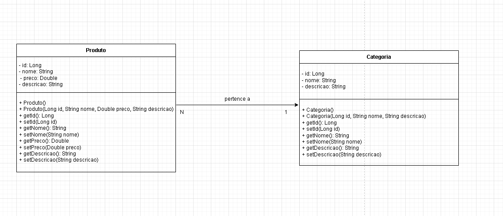

# Projeto: Avaliação de Spring Boot com MariaDB

Este é um projeto de avaliação que utiliza **Spring Boot** e **MariaDB** para gerenciar um sistema de **produtos** e **categorias**. A aplicação implementa um **relacionamento One-to-Many** entre as entidades `Produto` e `Categoria`.

---

## **Tecnologias Utilizadas**

- **Java 21**
- **Spring Boot** (com JPA e Hibernate)
- **MariaDB** como banco de dados
- **Postman** para testar os endpoints RESTful

---

## **Estrutura do Projeto**

O projeto foi estruturado com as seguintes entidades:

### **Entidades:**

- **Categoria**: Representa a categoria de um produto (Alimentos, Bebidas, Produtos de Limpeza, etc.).
- **Produto**: Representa o produto, com nome, descrição, preço e uma associação por ID com uma categoria.

A **Categoria** pode ter vários **Produtos**, configurado através do relacionamento **One-to-Many**. Cada **Produto** pertence a uma única **Categoria**.

### **Relacionamento entre as Entidades**:

- **One-to-Many**: Uma **Categoria** pode ter muitos **Produtos**.
- **Many-to-One**: Um **Produto** pertence a uma única **Categoria**.

---

## **Diagrama de Entidades**

Aqui está um diagrama simples representando o relacionamento entre as entidades **Produto** e **Categoria**:



---

## **Instruções para Rodar o Projeto**

### 1. **Clone o Repositório**

Primeiro, clone este repositório para sua máquina local:

```bash
git clone https://github.com/Kevthiago/AV1_API_ProdutoCategoria.git
```

## 2. Configuração do MariaDB

Você precisa configurar o MariaDB para rodar a aplicação corretamente. Siga as etapas abaixo:

### Instale o XAMPP:

- [Instruções de instalação do XAMPP](https://www.apachefriends.org/pt_br/index.html)

### Crie o banco de dados:

Ative o Apache e o MySQL na interface do XAMPP

Clique em "admin" no MySQL

No site phpMyAdmin, crie um banco de dados.

---

### Configuração do Banco de Dados no application.properties

Abra o arquivo `src/main/resources/application.properties` e configure as credenciais "nome_do_seu_banco", "seu_usuario" e "sua_senha" do seu MariaDB:

```properties
spring.datasource.url=jdbc:mariadb://localhost:3306/nome_do_seu_banco
spring.datasource.username=seu_usuario
spring.datasource.password=sua_senha

spring.jpa.hibernate.ddl-auto=update
spring.jpa.show-sql=true
spring.jpa.properties.hibernate.dialect=org.hibernate.dialect.MariaDBDialect
```

---

### 3. Rodar a Aplicação

Abra o projeto e navegue até Av1Application.java.

Execute no botão "Run"

A aplicação estará rodando na URL: [http://localhost:8080](http://localhost:8080).

---

### 4. Testando os Endpoints

Use o Postman ou curl para testar os seguintes endpoints:

- `GET /categoria`: Lista todas as categorias.
- `GET /categoria/{id}`: Busca uma categoria pelo ID.
- `POST /categoria`: Cria uma nova categoria.
- `PUT /categoria/{id}`: Atualiza uma categoria existente.
- `DELETE /categoria/{id}`: Deleta uma categoria.

- `GET /produto`: Lista todos os produtos.
- `GET /produto/{id}`: Busca um produto pelo ID.
- `POST /produto`: Cria um novo produto.
- `PUT /produto/{id}`: Atualiza um produto existente.
- `DELETE /produto/{id}`: Deleta um produto.

## Exemplo de Requisições com o Postman

### Criar Categoria (POST /categoria)

```json
{
  "nome": "Eletrônicos",
  "descricao": "Categoria de produtos eletrônicos."
}
```

### Criar Produto (POST /produto)

```json
{
  "nome": "Smartphone",
  "descricao": "Smartphone topo de linha.",
  "preco": 2999.99,
  "categoria": {
    "id": 1
  }
}

```

### Atualizar Produto (PUT /produto/{id})

```json
{
  "nome": "Smartphone Atualizado",
  "descricao": "Smartphone com novas funcionalidades.",
  "preco": 2599.99,
  "categoria": {
    "id": 1
  }
}

```

---

### Estrutura do Banco de Dados

As tabelas `categoria` e `produto` são criadas automaticamente com base nas entidades `Categoria` e `Produto`.

#### Exemplo de esquema:

```sql
CREATE TABLE categoria (
    id BIGINT AUTO_INCREMENT PRIMARY KEY,
    nome VARCHAR(255) NOT NULL,
    descricao VARCHAR(255)
);

CREATE TABLE produto (
    id BIGINT AUTO_INCREMENT PRIMARY KEY,
    nome VARCHAR(255) NOT NULL,
    descricao VARCHAR(255),
    preco DECIMAL(10, 2) NOT NULL,
    categoria_id BIGINT,
    FOREIGN KEY (categoria_id) REFERENCES categoria(id)
);
```

---

## Desenvolvido por

**[Seu Nome]**

Este projeto foi desenvolvido como parte da avaliação prática para a disciplina de Arquitetura Web, utilizando o Spring Boot, MariaDB, e RESTful APIs.

## Licença

Este projeto está licenciado sob a [MIT License](https://opensource.org/licenses/MIT).

---
